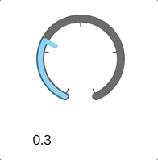
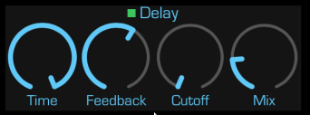

# Knob

Simple UISlider-like iOS control that depicts its path as an arc using CoreAnimation layers.

Like UISlider, touch movements control the value though with some deviations. For my implementation:

* Only vertical movements change the value. Moving up will increase the value, moving down will decrease it.
* By default, touch sensitivity is set to 4x the height of the knob -- a touch moving 4x the height would
  chanage the value from 0.0 to 1.0. See the documentation for the `touchSensitivity` parameter.
* Touch sensitivity can be increased by moving the touch horizontally away from the control (either direction).
  This is similar to the change in "scrubbing" speed when watching a video -- the further the touch moves away
  from the scrubber, the finer the positioning is within the video.
* For now, this control reports value changes continuously -- there is no way to disable this as there is for
  UISlider.

The above picture was taken from my [SoundFonts](https://github.com/bradhowes/SoundFonts) iOS app where the
knobs control various audio effects settings.

Included is a playground for playing with a knob.

## Configuration

* `minimumValue` -- the lowest value that the control will report out.
* `maximumValue` -- the highest value that the control will report out.
* `value` -- the current value of the control.
* `touchSensitivity` -- scaling factor between touch movement and value change. The default is `4` which means that one must drag 4x the size of the widget in order to change the value from
   `miminimumValue` to `maximumValue`.
* `trackLineWidth` -- the line width of the knob's arc that is drawn from the current value to the end.
* `trackColor` -- the color of the arc that is drawn from the current value to the end.
* `progressLineWidth` -- the line width of the knob's arc that is drawn from the start to the current value.
* `progressColor` -- the color of the arc thta is drawn from the start to the current value.
* `indicatorLineWidth` -- the line width of the knob's indicator that is draw from the current value towards the knob center.
* `indicatorColor` -- the color of the line that is drawn from the current value to the center.
* `indicatorLineLength` -- the amount of the line that is drawn from the current value to the center, where 0.0 indicates no line will be drawn, and 0.5 results in a line that is half-way to the knob center point.
* `startAngle` -- the starting point in radians of the arc (see below)
* `endAngle` -- the ending point in radians of the arc
* `tickCount` -- number of ticks to show
* `tickLineLength` -- fraction of a radius to draw (0.0 - 1.0)
* `tickLineWidth` -- width of the tick line
* `tickColor` -- the color of the tick line

Arc angles are explained well in the  [UIBezierPath documentation](https://developer.apple.com/documentation/uikit/uibezierpath/1624358-init). In brief, an angle of 0 will extend along the X axis, whereas an
angle of π/2 will extend along the negative Y axis.

The `draw` method used to render the knob's arc path draws in a clockwise fashion, so the end arc angle must be greater than the start arc angle. The default values leave the opening in the arc path centered
around the negative Y axis (pointing down), with an arc distance of 2/16 of the circumference.

## Touch Tracking

As one would expect, a touch in the knob's view area is tracked and any changes are reported to any registered actions:

* Moving vertically up will increase the knob's value
* Moving vertically down will decrease the knob's value
* Moving horizontally does not affect the value but it does alter the `touchSensitivity` value that is used to generate updates to the control's `value`, and the further away a touch moves horizontally from the center, the more sensitive the vertical movements become.
